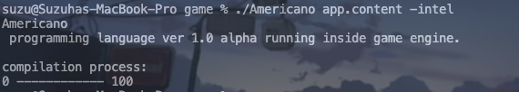

# Americano programming language.
ver 1.0 alpha

** STEP ONE: **
documentstion: http://185.97.200.31:1024/

** STEP TWO: **
launch Americano compiler. That's really easy...

** STEP THREE: **
write ./app in your console or double click on app icon.
